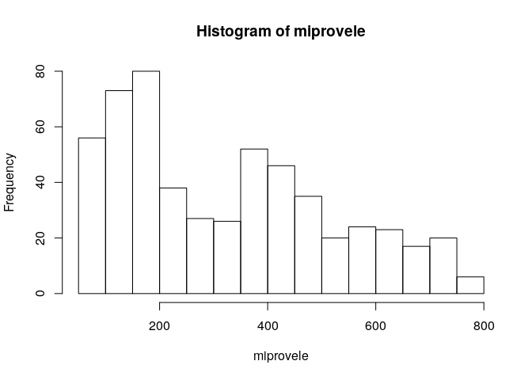

Unidad 1, asignación 2: exportar datos, leer ráster y extraer valores
=====================================================================

Sigo ayudando con `...`. Donde quiera que los veas, deberás sustituirlos por lo que indique el correspondiente mandato.

Dentro de las opciones de `knitr`, en el encabezado de este archivo, es probable que encuentres el argumento `eval = F`. Antes de tejer debes cambiarlo a `eval = T`, para que evalúe los bloques de código según tus cambios.

Provincia asignada
------------------

Toma nota del código de tu provincia asignada aleatoriamente.

``` r
 # abreviatura provaleatoria
 #       acade            11
 #       agrie            09
 #       aleir            10
 #       arqco            16
 #       cindy            12
 #       franc            23
 #       geora            08
 #       hoyod            22
 #       ingan            07
 #       ingdi            19
 #       itac9            15
 #       ivanv            25
 #       lbine            30
 #       leona            24
 #       magda            20
 #       maryj            02
 #       masue            26
 #       mmvol            13
 #       naui2            29
 #       rober            27
 #       wilne            06
 #       yoenn            21
```

Paquetes
--------

-   Carga el paquete `sf` y el paquete `raster`.

``` r
library(sf)
## Linking to GEOS 3.7.1, GDAL 2.4.2, PROJ 5.2.0
library(raster)
## Loading required package: sp
```

Exporta
-------

-   Determina el nombre de la capa provincias con `st_layers` del archivo GeoPackage que se encuentra en la carpeta `data`.

-   Carga la capa de provincias con la función `st_read`, asignándola al objeto `prov`.

-   Genera el objeto `miprov` que sólo contenga tu provincia.

-   Usando la función `st_write`, exporta el objeto `miprov` como GeoPackage a la carpeta `data` con el nombre `miprovexportado.gpkg`.

-   Lee el archivo exportado con la función `st_read` y asígnalo al objeto `miprovexportado`. Dado que sólo tiene una capa, no tienes que especificar el argumento `layer`.

-   Imprime en pantalla el objeto `miprovexportado` (sólo necesitas escribir el nombre del objeto).

``` r
st_layers('data/divisionRD.gpkg')
## Driver: GPKG 
## Available layers:
##      layer_name geometry_type features fields
## 1 PROVCenso2010       Polygon       32      4
## 2  MUNCenso2010       Polygon      155      5
## 3  REGCenso2010       Polygon       10      2
prov <- st_read(dsn = 'data/divisionRD.gpkg', layer = 'PROVCenso2010')
## Reading layer `PROVCenso2010' from data source `/home/ingdi/unidad-1-asignacion-2-rasters-y-exportar-datos-espaciales-lodurr/data/divisionRD.gpkg' using driver `GPKG'
## Simple feature collection with 32 features and 4 fields
## geometry type:  MULTIPOLYGON
## dimension:      XY
## bbox:           xmin: 182215.8 ymin: 1933532 xmax: 571365.3 ymax: 2205216
## epsg (SRID):    32619
## proj4string:    +proj=utm +zone=19 +datum=WGS84 +units=m +no_defs
miprov <- prov[prov$PROV %in% '19', ]
st_write(obj = miprov, dsn = 'data/miprovexportado.gpkg', driver = 'GPKG')
## Updating layer `miprovexportado' to data source `data/miprovexportado.gpkg' using driver `GPKG'
## Updating existing layer miprovexportado
## Writing 1 features with 4 fields and geometry type Multi Polygon.
miprovexportado <- st_read(dsn = 'data/miprovexportado.gpkg')
## Reading layer `miprovexportado' from data source `/home/ingdi/unidad-1-asignacion-2-rasters-y-exportar-datos-espaciales-lodurr/data/miprovexportado.gpkg' using driver `GPKG'
## Simple feature collection with 2 features and 4 fields
## geometry type:  MULTIPOLYGON
## dimension:      XY
## bbox:           xmin: 346936.3 ymin: 2126819 xmax: 369032.9 ymax: 2163560
## epsg (SRID):    32619
## proj4string:    +proj=utm +zone=19 +datum=WGS84 +units=m +no_defs
miprovexportado
## Simple feature collection with 2 features and 4 fields
## geometry type:  MULTIPOLYGON
## dimension:      XY
## bbox:           xmin: 346936.3 ymin: 2126819 xmax: 369032.9 ymax: 2163560
## epsg (SRID):    32619
## proj4string:    +proj=utm +zone=19 +datum=WGS84 +units=m +no_defs
##   PROV REG        TOPONIMIA ENLACE                           geom
## 1   19  03 HERMANAS MIRABAL   0319 MULTIPOLYGON (((368431.6 21...
## 2   19  03 HERMANAS MIRABAL   0319 MULTIPOLYGON (((368431.6 21...
```

Ráster
------

-   Con la función `raster`, carga el modelo digital de elevaciones que se encuentra en la carpeta `data`. Es el único archivo de extensión `.tif` Asígnalo al objeto `mde`

-   Genera un mapa con la función `plot`, usando la paleta de colores `terrain.colors`.

``` r
mde <- raster('data/mde_rd.tif')
plot(mde, col = terrain.colors(n = 255))
```


Extraer valores del ráster
--------------------------

-   Con la función `raster::extract`, extrae los valores de elevación correspondientes a tu provincia. Utiliza `mde` como objeto ráster y `miprov` como capa zonal. Asigna los valores al objeto `miprovele`.

-   Imprime en pantalla el objeto `miprovele` (sólo necesitas escribir el nombre del objeto).

-   Obtén los estadísticos descriptivos básicos (mínimo, primer cuartil, media, mediana, tercer cuartil, máximo) de `miprovele` con la función `summary`.

-   Genera un histograma de `miprovele` usando la función `hist`.

``` r
miprovele <- raster::extract(mde, miprov)[[1]]
miprovele
##   [1] 114.15 180.44 286.68 299.25 265.35 161.06 119.92 141.52 192.36 324.11
##  [11] 378.72 290.42 489.41 366.46 241.64 142.14 146.55 193.96 357.82 341.78
##  [21] 359.94 337.61 340.43 401.72 493.40 516.95 568.13 495.94 339.40 198.38
##  [31] 147.55 170.23 269.92 320.99 414.36 340.15 396.67 387.06 429.37 492.00
##  [41] 562.65 546.26 559.92 523.00 384.99 263.90 180.44 153.81 185.17 226.68
##  [51] 285.64 365.61 365.70 437.65 385.70 426.19 424.62 475.58 587.52 600.92
##  [61] 595.83 596.20 586.11 614.61 567.22 402.96 282.67 196.27 188.59 169.75
##  [71] 204.02 268.40 357.74 441.65 374.17 400.58 475.09 479.49 447.61 447.80
##  [81] 495.08 615.87 626.12 639.32 626.05 637.93 648.76 634.05 429.61 309.86
##  [91] 236.28 193.32 187.39 193.43 229.47 335.52 432.66 513.10 454.43 500.14
## [101] 484.97 532.19 571.09 662.73 654.37 685.08 667.99 678.02 676.60 662.21
## [111] 449.62 314.79 247.71 221.48 212.98 235.43 248.50 277.13 379.92 516.23
## [121] 581.80 487.98 551.32 589.58 635.90 714.14 687.43 701.54 708.17 709.66
## [131] 715.42 674.09 471.00 344.54 262.47 252.33 260.57 284.44 271.34 299.57
## [141] 339.99 482.32 558.42 496.73 560.30 647.38 736.75 774.09 735.98 699.84
## [151] 736.83 737.65 645.59 480.14 374.61 368.28 328.70 435.23 444.71 532.40
## [161] 573.81 636.16 732.48 756.66 778.84 761.48 739.59 727.73 604.01 485.76
## [171] 415.23 370.63 355.51 496.86 512.30 481.07 538.67 578.35 708.10 713.62
## [181] 774.89 765.40 606.01 560.54 494.40 438.20 396.53 370.54 350.20 518.20
## [191] 558.42 503.97 565.76 615.44 701.81 711.04 732.60 724.50 606.80 490.86
## [201] 436.54 413.88 383.05 373.85 368.60 617.25 591.07 537.33 621.76 650.98
## [211] 651.49 693.93 720.92 721.37 628.82 512.02 428.94 400.56 382.24 357.21
## [221] 345.26 340.64 328.72 323.77 589.61 538.05 574.74 610.51 651.73 650.78
## [231] 690.83 680.69 611.15 534.24 455.77 424.65 392.92 370.95 386.41 374.37
## [241] 346.16 347.99 435.69 459.61 412.88 499.21 455.93 577.24 545.44 596.75
## [251] 601.81 525.30 460.67 434.21 416.14 391.83 403.56 400.25 378.82 370.05
## [261] 361.93 398.51 363.37 427.08 390.29 478.41 420.59 493.74 522.93 445.53
## [271] 439.32 435.96 427.06 424.77 425.15 400.62 384.62 357.47 312.60 342.54
## [281] 324.07 381.34 381.71 432.66 366.61 380.05 378.56 450.20 497.47 486.57
## [291] 463.81 433.02 433.28 408.98 378.58 265.31 260.24 271.04 296.22 327.15
## [301] 361.46 345.37 359.43 381.43 392.96 413.45 491.58 506.96 474.89 421.93
## [311] 232.28 239.86 235.18 229.83 242.72 253.41 266.77 268.97 371.59 366.94
## [321] 320.85 386.43 353.41 417.32 456.32 454.47 219.89 221.39 221.11 224.10
## [331] 219.52 222.93 217.99 226.21 247.90 255.43 265.15 299.27 325.50 403.71
## [341] 207.79 210.44 208.77 209.54 208.44 205.81 203.19 204.91 203.77 205.83
## [351] 207.67 215.79 240.32 286.27 192.17 193.14 193.56 199.00 194.46 194.60
## [361] 192.28 190.50 190.42 188.54 184.95 181.00 185.15 197.83 207.74 184.48
## [371] 177.18 184.47 186.20 184.30 181.54 182.94 177.22 176.92 173.82 172.49
## [381] 168.38 171.95 178.32 180.10 169.09 178.89 167.30 171.53 175.07 167.21
## [391] 171.17 169.49 166.59 164.86 162.07 161.54 162.82 163.83 166.41 166.12
## [401] 160.23 163.65 158.06 168.83 166.94 157.89 160.48 157.39 155.92 156.34
## [411] 156.53 149.18 150.07 151.16 152.90 148.72 147.95 148.65 158.95 158.74
## [421] 148.01 158.97 155.03 150.51 145.70 144.78 141.78 137.49 140.15 143.32
## [431] 149.90 149.68 141.00 151.68 145.02 148.13 141.61 136.98 132.54 129.13
## [441] 134.33 138.44 140.56 135.18 139.35 136.96 138.16 135.78 132.51 128.22
## [451] 124.77 127.47 130.71 127.42 126.80 130.26 126.65 125.31 124.89 124.55
## [461] 118.24 120.11 121.94 117.99 116.09 116.69 116.64 116.60 117.77 114.20
## [471] 112.81 113.05 113.37 112.48 112.00 108.75 106.55 106.60 106.78 106.15
## [481] 103.61 105.58 107.69 105.05 103.56 102.39 100.35  99.71  99.37  97.26
## [491]  95.14  97.87  99.74  99.39  96.09  95.77  95.86  94.54  92.20  89.46
## [501]  88.82  92.62  93.91  93.36  91.09  90.61  88.86  88.17  85.09  88.59
## [511]  90.99  87.55  84.85  84.29  85.38  83.73  85.41  83.27  82.79  79.99
## [521]  79.86  81.52  80.90  78.37  78.36  76.46  78.47  76.81  75.66  74.92
## [531]  73.31  75.55  73.21  72.02  71.23  70.67  71.01  69.74  68.51  68.12
## [541]  67.71  67.35  69.47
summary(miprovele)
##    Min. 1st Qu.  Median    Mean 3rd Qu.    Max. 
##   67.35  155.47  299.25  326.55  467.40  778.84
hist(miprovele)
```


